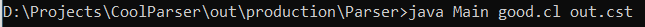
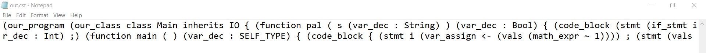
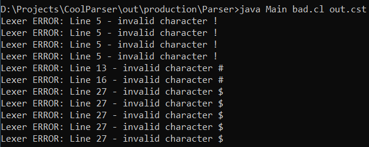
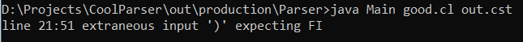

# Parser Implementation


# How to use:
The Main.java file can invoked from the command line (cmd) with the line and takes the input file either a source code file (ex. input.cl) or a token text file from the previous lexer phase (ex. input.cl-lex).
The Main.java can also take a second optional parameter which is a text file for the resultion tree to be stored in (ex. tree.cst)
```
//Compile the file
javac -cp "( ANTLRPATH HERE )\antlr-4.8-complete.jar;" yourPath/Main.java (Also add all the antlr generated class files to be compiled)

 

//Run the file with the parameter
java -cp "( ANTLRPATH HERE )\antlr-4.8-complete.jar;" Main good.cl (optional tree.cst)
```

 

# Design Phase :
After the Lexer phase was done it was time to try to construct a correct set of parsing rules for the parser to follow and ensure that the given code or tokens are actually correct.
The process was that we looked at diffrenet examples of the COOL language to try to get a deeper understanding of all the cases that we should consider when writing the parsing rules.
 

# Test Cases :
As we liked the test files from the previous stage we didn't feel we needed to change them.

1) The good.cl file was choosen to contain as many tokens as possible with alot of keywords. (The file contains code to check if a text is a palindrome or not) 
If we run this from the cmd you should get this output <br>
 <br>
And a new out.cst file is created <br> 
<br>
2) The good.cl-lex is the file containing the tokens from the previous lexer stage
3) The bad.cl file contains the same code with some extra charachters that wouldn't be recogonized by our lexical analyzer. 
The only thing that we thought of and wouldn't be recognized is the special charachters (!, #, etc..) <br>
If the file has syntax error then you would LEXER errors
<br>
If it is tokenized successfully but has some errors that don't follow the language rules you would get an error like <br>
<br>
# Documentation :
We used Doxygen to generate a well structured documentaion for the Main.java file as well as the generated files by the ANTLR tool.
To view the documetion open the folder Documentation and open index.html the rest is easy to figure out.
